# Exodus v1.3 — Dashboard Audit

**Started:** 2026-06-03
**Auditor:** Lucas (`lukemiha@gmail.com`, Member role, brand `flow2`)
**Scribe:** Claude (terminal — reads saved screenshots, writes findings + fixes)
**For:** Brad (implements) + any downstream AI he hands this to
**Dashboard under review:** `https://agent-dash-groundco.vercel.app` (note: Grounding Co dev URL — wrong-brand identity, prior Finding #8)

**Prior passes:** v1.1 (dashboard/onboarding/primer-setup, #1–24) · v1.2 (creative-generation, #25–36).
This pass continues finding numbers at **#37** and actions at **A.45**.

---

## How to read this doc (for Brad + downstream AI)

Each finding is **self-contained** so it can be lifted out and worked in isolation:

- **ID** — `#NN` finding, `A.NN` the corresponding action item.
- **Area** — which dashboard surface (tab / view / component).
- **Severity** — P0 (blocks customer / wrong-brand) · P1 (broken or badly confusing) · P2 (polish / nice-to-have).
- **What** — the observed behavior, in plain language.
- **Where** — exact URL / tab / element so it's reproducible.
- **Repro** — numbered steps to see it.
- **Screenshot** — relative path under `screenshots/`, referenced verbatim.
- **Expected** — what should happen instead.
- **Proposed fix** — Lucas's / Claude's suggested change (may be code-level or UX-level).
- **Status** — `open` / `needs-brad-input` / `fixed-in <ver>`.

Screenshots live in `screenshots/` and are **never edited** — saved exactly as captured. Filenames encode the finding: `NN-short-slug.png`.

---

## TL;DR — running summary

- **#37 (P1)** — "New batch run" modal: Ad copy is hard-required (min 20 chars) and Steering/image-direction is buried at the bottom. Steering-only runs (no copy) are a real use case and currently impossible.
- **#38 (P1)** — Native and Template are separate runs with separate buttons ("Fire 7 images" vs "Run template"); switching engine toggle + running one **discards the other's queued config**. Should be one unified "Run ads" that fires Native + Template together as a single filtered batch.
- **#39 (P1)** — Templates that need specific assets (e.g. **Founder Ad** → handwritten note + hero/product image + founder info) don't guarantee the right inputs are fed in. Brand Info only collects Founder name + Product photos (no handwritten-note field); Flow2 has none populated; unclear if templates even pull these. Needs per-template input requirements + run-time validation.
- **#40 (P1)** — **Library → Search is broken.** "eye" returns 2 unrelated Meme cards; "worm" returns **0 results / No images** despite worm imagery existing (the v1.2 gore series). Search isn't matching on the ad's actual visual content — needs proper indexing (concept/subject, copy, steering, template, tags) and likely semantic search.
- **#41 (P1/P2)** — Swipe-mining scraped-ad grid is ugly: **video cards have no thumbnail** (generic camera icon for all 11 videos) and **static cards show broken-image alt-text** ("Healthy Skin Starts Within") instead of the image. Needs poster frames + fixed image src + visual cleanup.
- **#42 (P1)** — Swipe mining **can't run without a Facebook Page ID** (Men Go To Mars blocked; IG handle alone insufficient). Plus a noisy red banner dumping "20 brand(s) failed: Regression Preflight … No Facebook Page found." Auto-resolve/prompt for FB Page ID, gate the run button, clean up the error surface. (Echoes v1.2 #30.)
- **#43 (P2)** — "Swipe this ad" variant modal: the **awareness-level flow (Unaware/Problem/Solution/Product) is the desired model** (Lucas confirms) — but video swipes show "no image" (same thumbnail gap as #41).
- **#44 (P2)** — "Since" date field: clicking the date only highlights the digits; you must hit the tiny calendar icon to open the picker. **Whole bar should open it.**
- **#45 (P2)** — Gambit "Brain-dump" placeholder reads "A bunch of random shit you think…" — **unprofessional copy** on a customer surface. Rewrite (and audit other crude placeholders).
- **#46 (P1)** — Primer editor renders all four primers **fully expanded and way too long** — one fills the whole screen. **Make each collapsible** (collapsed by default, summary in header) so they're sortable.

---

## Findings

### #37 — "New batch run": let steering drive a run without ad copy; promote steering higher
- **Area:** Dashboard → image generation → **New batch run** modal (Native engine view).
- **Severity:** P1 — blocks a legitimate workflow (steering-only image runs).
- **What:** Two coupled problems in the modal:
  1. **Ad copy is required** — labeled with a red `*`, footer reads `0 chars (min 20)`. The placeholder says "Required for Reptile and Copy-Derived runs," but the field is enforced as required for the *whole modal*, not just those engines.
  2. **Steering / image direction is too low** — it sits near the bottom (below Batch name → Engine → Ad copy → Engines/quantities), labeled "(optional)." For a steering-led run that's backwards: steering is the primary input and copy is secondary/absent.
  - Lucas: people will often want to enter **only** a steering / image direction and **no ad copy** — that path needs to work. (Noted he flagged this in a prior pass too.)
- **Where:** New batch run modal. Fields in current order: Batch name · Engine (Native/Template) · **Ad copy** `*` · Engines (Reptile / Copy-Derived quantities) · **Steering / image direction (optional)** · Aspect ratios.
- **Repro:**
  1. Open **New batch run**.
  2. Observe **Ad copy** carries a red `*` and `min 20` enforcement.
  3. Observe **Steering / image direction** is at the bottom, marked optional.
  4. Try to run with steering filled and ad copy empty → blocked by the min-20 requirement.
**Screenshot:**

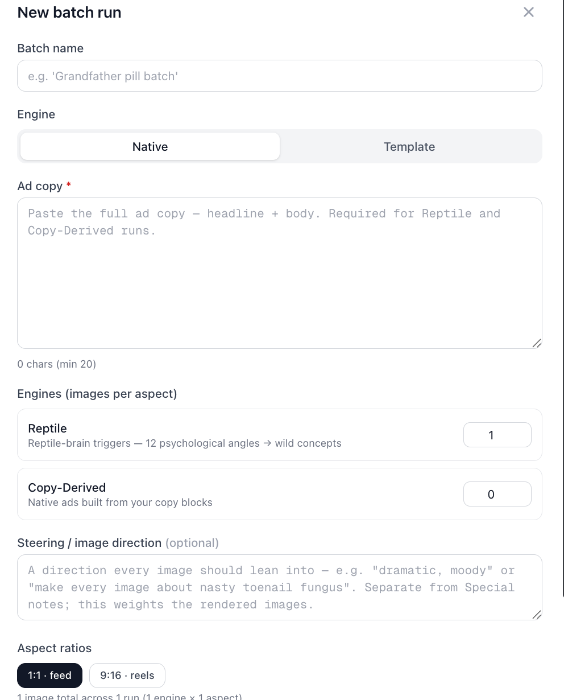

- **Expected:** A user can submit with **steering filled and ad copy empty**, as long as the selected engines don't require copy. Steering should read as a first-class input, not a footnote.
- **Proposed fix:**
  1. **Make Ad copy conditionally required, not globally.** Require copy (min 20) **only when Reptile or Copy-Derived quantity > 0** (the two engines that consume copy). If both are 0, copy is optional. Update the `*` and the `0 chars (min 20)` validator to react to engine quantities.
  2. **Allow a steering-only run path.** When ad copy is empty, the run must still be valid if steering is non-empty and the active engine produces images from steering alone. (Confirm with Brad which engine backs a copy-less, steering-only run — may need an explicit "steering-only" engine/mode, or Reptile to accept steering as its seed.)
  3. **Reorder the modal** so Steering / image direction sits **above Ad copy** (or immediately under Engine), reflecting that steering can be the primary driver. Re-label so neither field reads as unconditionally required.
- **Status:** open — **needs Brad input** on which engine renders a copy-less steering-only run.

### #38 — Unify Native + Template into one "Run ads" batch; stop wiping the other engine's queue
- **Area:** Dashboard → **New batch run** modal → **Engine** toggle (Native | Template).
- **Severity:** P1 — silent data loss (configured runs get discarded on engine switch) + forces two passes for what should be one batch.
- **What:** Native and Template behave as two **separate runs with two separate submit buttons**:
  - On **Native**: footer button **"Fire 7 images"**, summary **"7 images total across 2 runs (2 engines × 1 aspect)"** (e.g. Reptile 4 + Copy-Derived 3).
  - On **Template**: footer button **"Run template"**, summary **"Template runs use the first selected aspect. One ad at a time — batch via the CLI."**
  - If you queue up Native (e.g. 7 images), then flip the Engine toggle to **Template**, set that up, and hit **"Run template,"** it **eliminates the Native config you'd already set up** — only the template fires. The two don't share a queue; switching the toggle clobbers the other side.
- **Where:** Engine toggle at top of the modal; the two footers differ by selected engine (see screenshots).
- **Repro:**
  1. Open **New batch run**, Engine = **Native**. Set Reptile = 4, Copy-Derived = 3 → button reads **"Fire 7 images."**
  2. Flip Engine toggle to **Template**; configure a template run.
  3. Hit **"Run template."**
  4. The 7 Native images you'd queued are gone — only the template ran.
**Screenshot:**

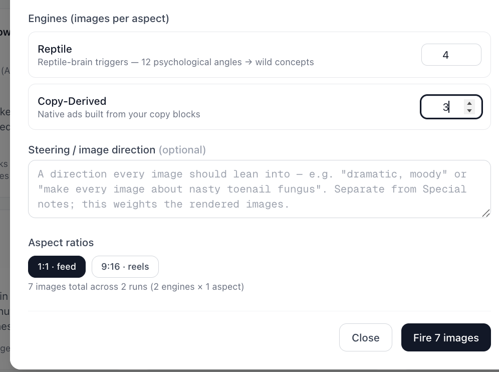

**Screenshot:**

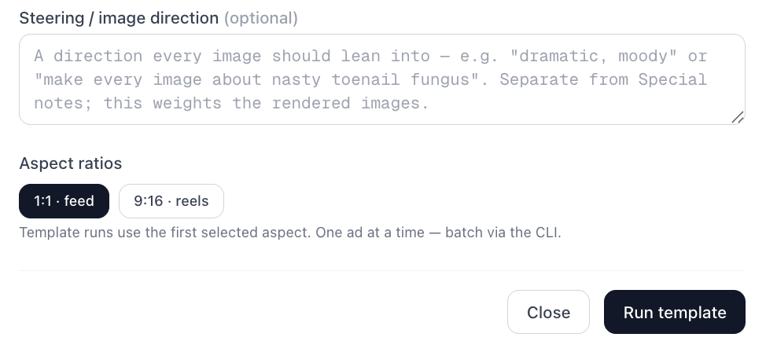

- **Expected:** One unified action — **"Run ads"** — that fires **everything configured across both Native and Template** in a single batch. Toggling between engines **preserves** each side's config; nothing is discarded. The total-count line rolls up across both engines and both run types.
- **Proposed fix:**
  1. **Persist per-engine config in modal state** so toggling Native↔Template never resets the other side.
  2. **Collapse the two buttons into one "Run ads"** (or "Fire N ads") that submits the combined batch — Native runs + Template runs fired together.
  3. **Roll the count up across both** engines + run types in the summary line.
  4. *(Consider)* drop the either/or toggle in favor of two sections (Native, Template) both feeding one batch — matches Lucas's "filtered together" mental model.
- **Status:** open — Lucas notes this was flagged in a prior pass too; still present on `2026.5.2903`-era dashboard.

### #39 — Templates must declare & receive the right inputs (Founder Ad → handwritten note + hero/product image + founder info)
- **Area:** Settings → **Brand Info** tab **and** the template run flow (the link between them).
- **Severity:** P1 — without the right assets, asset-dependent templates render generic/empty or wrong output.
- **What:** Some templates need specific inputs that the flow doesn't currently guarantee. Lucas's example — the **Founder Ad** template — should be fed:
  - the **handwritten note** (handwritten-style note) — **no field for this exists anywhere**,
  - the **hero image / what the product looks like** → product image,
  - **founder information** (name, and possibly more) → founder field.
  - **Brand Info** today collects only: **Founder** (name only — placeholder "e.g. Jordan Lee", with a Save button) and **Product images → Product photos** (drag/Browse, JPEG/PNG/WebP/GIF, max 15 MB each; currently **"No product images uploaded yet"**).
  - Gaps: (a) **no handwritten-note input** at all; (b) Flow2 has **no founder/product info populated**; (c) **unclear whether the template flow actually pulls these Brand Info assets** or asks for them at run time. Lucas: "I don't have any product info or founder stuff… that needs to be in there as well, but I'm not sure [if we have it]."
- **Where:** Settings → **Brand Info** (sub-tabs: Claude Code · Primer · Brand Info · Google Drive · API Reference · API Keys). Header: "Details about Flow2 — the brand you're creating ads for. These feed image generation so your ads show the right founder and product." Sections: **Founder** (name + Save) and **Product images → Product photos** (upload dropzone, empty).
- **Repro:**
  1. Settings → **Brand Info** → see only **Founder name** + **Product photos**. No handwritten-note field. Both empty for Flow2.
  2. Run a **Founder Ad** template → nothing prompts for or guarantees a handwritten note, hero/product image, or founder details.
**Screenshot:**

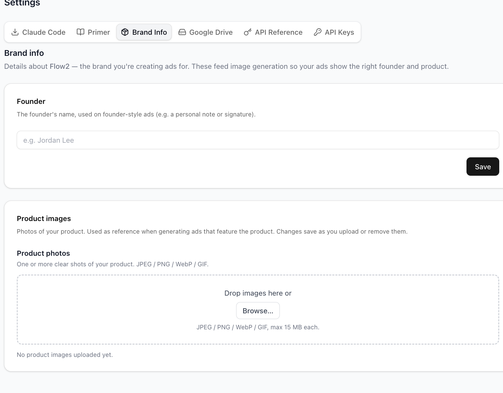

- **Expected:** Each template **declares the inputs it requires**, and the run flow **ensures they're supplied** — pulled from Brand Info, or requested inline at run time with a clear "missing X" prompt rather than a silent generic render.
- **Proposed fix:**
  1. **Per-template input manifest** (required + optional assets). E.g. Founder Ad = `{founder_name, handwritten_note, hero/product_image}`.
  2. **Run-time validation against Brand Info** — if a required asset is missing, prompt for it inline; never silently render without it.
  3. **Add a "handwritten note" input** — a Brand Info field and/or per-run field (text rendered in a handwritten style, or upload of an actual handwritten-note image).
  4. **Clarify global vs per-run** — is founder/product/note global (Brand Info) or per-run overridable? Document where the user puts each asset.
- **Note (don't conflate):** this is about **visual product/founder ASSETS for templates** (a founder ad legitimately needs a face + note + product shot) — distinct from the [[primer-philosophy]] concern about brand-detail *text* being a contamination risk. Different axis; both can be true.
- **Status:** open — **needs Brad input** on whether template↔Brand-Info wiring exists yet, and where handwritten notes should live.

### #40 — Library Search doesn't match ad content (wrong results + false "0 results")
- **Area:** Dashboard → **Library** → **Search** tab ("Your AI-generated ads").
- **Severity:** P1 — search is a primary way to find past ads; right now it can't surface them.
- **What:** Search doesn't match on what the ads are actually *about*:
  - Query **"eye"** → **"2 results for 'eye'"**, both **Meme** cards: "Meme — Create a meme image in the exact layout of 'Panik…'" and "Meme — Create a meme in the 'Clown Applying Makeup'…" — neither is plainly about eyes.
  - Query **"worm"** → **"0 results for 'worm' / No images"** — even though worm imagery exists (the v1.2 gore "worms-in-eye" series).
  - So it's matching the wrong field (looks like a narrow prompt/title string) and **missing the actual visual subject/concept** of generated images.
- **Where:** Library → Search. UI: search box, **"All sources"** dropdown, **Search** button; results render as cards tagged by type (e.g. "Meme") with truncated prompt text.
- **Repro:**
  1. Library → **Search**. Type **"eye"** → 2 Meme results, not clearly eye-related.
  2. Type **"worm"** → **"0 results for 'worm' / No images"** despite worm images existing.
**Screenshot:**

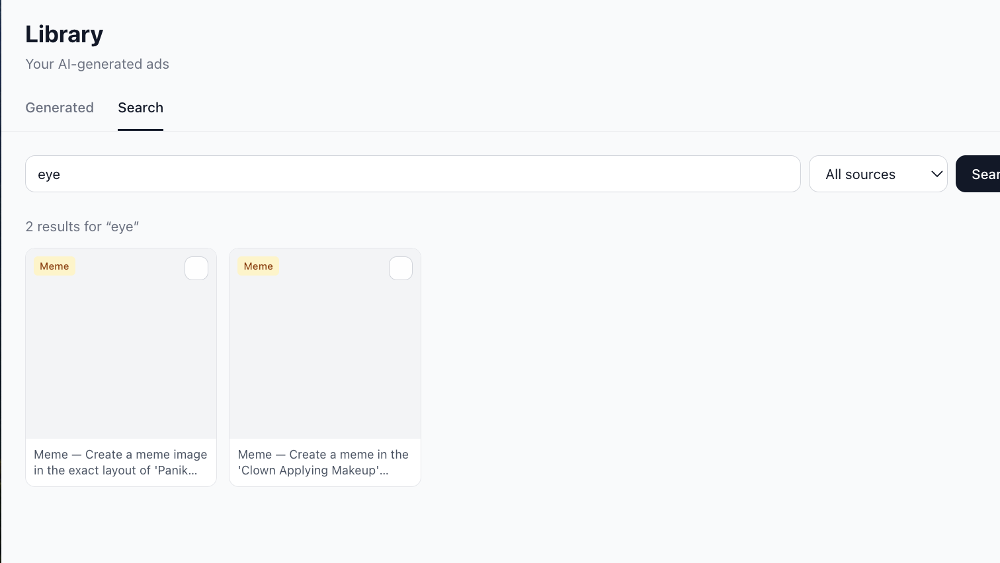

**Screenshot:**

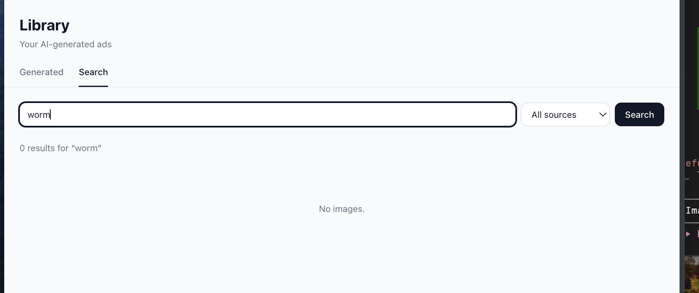

- **Expected:** Search matches the ad's real content — **image concept/subject, ad copy, steering / image-direction text, template name, tags** — so "worm" finds the worm images and "eye" finds eye images.
- **Proposed fix:**
  1. **Index the right fields** (concept/subject, copy, steering text, template name, tags), not just a prompt-title string.
  2. **Add semantic/vector search** over image captions or stored concepts so visual-subject queries work even without literal keyword matches.
  3. **Verify the v1.2 worm/gore runs are actually in the index** — the "0 results" may be a data/indexing gap, not only a query-matching gap.
- **Open Q:** does the **"All sources"** filter constrain this? Re-test with an explicit source selected.
- **Status:** open — **needs Brad input** on what fields are currently indexed and whether older runs are backfilled.

### #41 — Swipe-mining scraped-ad grid: missing video thumbnails + broken static thumbnails + ugly
- **Area:** Swipe mining → brand detail → scraped-ads grid (Heart and Soil shown).
- **Severity:** P1 (no thumbnails = can't see what you scraped) + P2 (visual ugliness).
- **What:**
  - **Video cards have no thumbnail** — all show a generic video-camera placeholder icon, not a poster frame. Stats line: **"30 scraped ads · 30 active · 🖼 19 · 📹 11 · ▦ 0 · Last scraped 5/29/2026"** — the 11 videos render no preview.
  - **Static cards show broken-image alt-text** — several tiles render the alt string ("Healthy Skin Starts Within", "Elevate Your Vitality.") instead of the actual image. Only one tile (a "STABLE HORMONES / HER PACKAGE" image) renders a real picture.
  - Each card has a "Nd running" + green **"live"** badge overlay.
  - Lucas: "This just really looks ugly… there's still no thumbnails that are on the videos."
- **Where:** Swipe mining → mined brand → scraped-ads grid.
- **Repro:** open a mined brand (Heart and Soil) → grid shows broken static thumbnails + video placeholder icons.
**Screenshot:**

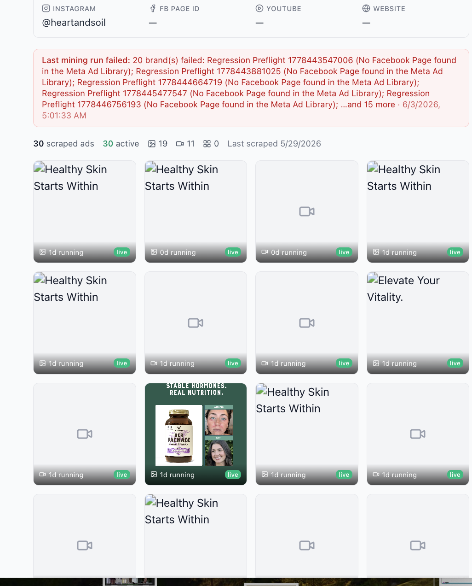

- **Expected:** video cards show a real poster frame; static cards show the scraped image; grid is clean and consistent.
- **Proposed fix:**
  1. Capture + store a **poster frame per scraped video**; render it as the card thumbnail.
  2. **Fix broken static thumbnails** — image `src` is failing (falling back to alt text); confirm scraped image URLs are stored + reachable (CORS / expired Meta CDN URLs?).
  3. **Visual cleanup** — consistent card sizing, loading states, no raw alt text on screen.
- **Status:** open.

### #42 — Swipe mining can't run without a Facebook Page ID; noisy "20 brands failed" error banner
- **Area:** Swipe mining → brand detail (Men Go To Mars) + the failed-run error banner.
- **Severity:** P1 — blocks mining for any IG-only brand; the error surface is noisy and leaks test data.
- **What:**
  - **MGTM can't be mined** — "Men Go To Mars / mens-wellness", IG `@mengotomars`, **FB PAGE ID = "—"**. Panel note: *"A Facebook Page ID is required — an IG handle alone isn't enough to query the Meta Ad Library."* Clicking **"Run swipe mining"** yields nothing — *"No swipe mining run yet."* Lucas: "it's not letting me run the swipe mining on this either at all."
  - **Noisy error banner** (red): *"Last mining run failed: 20 brand(s) failed: Regression Preflight 1778443547006 (No Facebook Page found in the Meta Ad Library); Regression Preflight 1778443881025 (…); … and 15 more · 6/3/2026, 5:01:33 AM"* — a 20-brand batch failure dumped as one long string. The **"Regression Preflight 17784…"** entries look like test/seed fixtures leaking into a customer view.
- **Where:** Swipe mining → MGTM brand detail; banner appears on brand-detail pages.
- **Repro:**
  1. Open MGTM (or any brand with no FB Page ID) → click **"Run swipe mining."**
  2. Nothing scrapes; *"No swipe mining run yet"* persists; FB-page-required note shows.
  3. Red banner lists 20 failed "Regression Preflight" brands.
**Screenshot:**

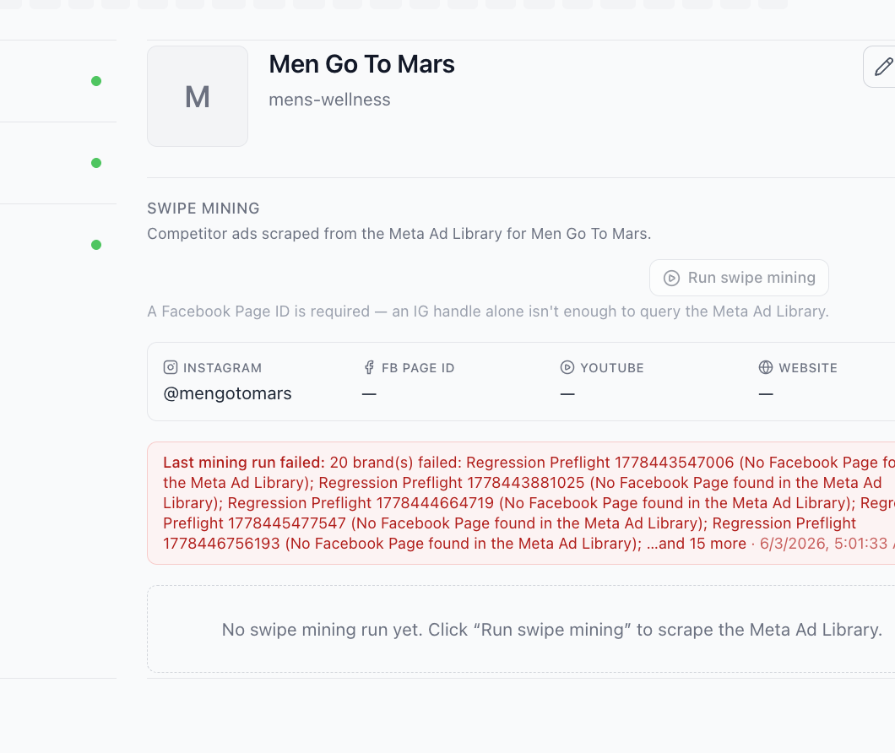

- **Expected:** either resolve the FB Page ID from the IG handle / brand name automatically, or prompt for it up front (before running), with a clean per-brand error — not a 20-brand concatenated dump, and no test fixtures in the customer view.
- **Proposed fix:**
  1. **Resolve FB Page ID from IG handle / brand name** via Meta Ad Library lookup where possible; otherwise add a clear **FB Page ID input** on the brand with validation.
  2. **Gate "Run swipe mining"** — disable + explain when no FB Page ID, instead of letting it run and fail.
  3. **Clean up the error surface** — per-brand inline errors, not one giant string; **hide "Regression Preflight" test brands** from customer views.
- **Open Q for Brad:** what are the "Regression Preflight 17784…" brands and why are they in a customer's failed-run list?
- **Status:** open — **needs Brad input**. (Echoes v1.2 Finding #30 — MGTM won't scrape.)

### #43 — "Swipe this ad" variant modal: awareness-level flow is the desired model; video shows "no image"
- **Area:** Swipe mining → **"Swipe this ad"** variant-generation modal (Heart and Soil video ad).
- **Severity:** P2 — the flow is right; the preview is the only gap.
- **What:** Generating a variant of a scraped ad opens **"Swipe this ad."** For a Heart and Soil video (*"Competitor ad · video", "Support Your Cycle From the Inside Out"*):
  - **"no image"** placeholder (no video thumbnail — same root cause as #41).
  - **Mode** toggle: **Images** (disabled) / **Copy** (selected) — *"Images need a static ad — this swipe is a video, so Copy is used."*
  - **Awareness level** radios: **Unaware** / **Problem Aware** / **Solution Aware** / **Product Aware** (each with a one-line definition).
  - **Concepts to write**: number input (2; *"How many copy concepts to write (1–10). Defaults to 6."*).
  - **Cancel / Write copy.**
  - Lucas: for generating a variant it "should just be unaware / problem aware / solution aware / product" — i.e. **this awareness-level selection is exactly the desired model** (confirming the flow).
- **Where:** "Swipe this ad" modal.
- **Repro:** in the scraped grid, swipe/variant a video ad → modal opens showing "no image."
**Screenshot:**

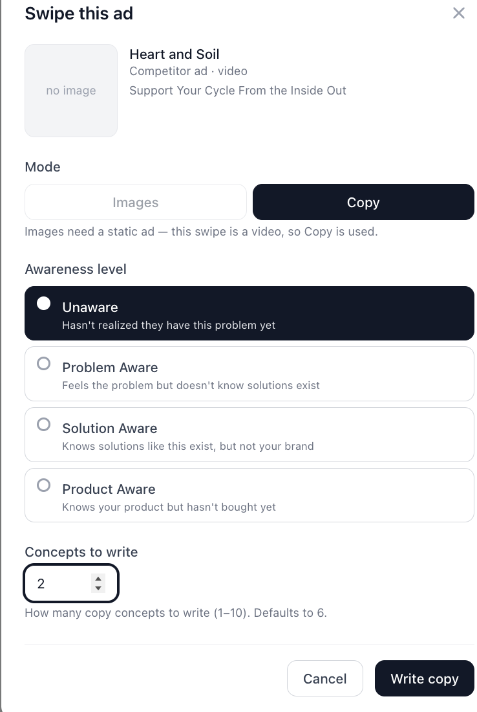

- **Expected:** keep the awareness-level + concepts-count flow (good); show the **video poster frame** instead of "no image."
- **Proposed fix:** render the poster frame in the preview (depends on #41's thumbnail fix); leave the awareness-level/concepts model as-is.
- **Status:** open — **confirm-intent** with Lucas that the modal is good aside from the preview.

### #44 — "Since" date field: only the tiny calendar icon opens the picker; the whole bar should
- **Area:** Date filter — **"Since"** field (next to a search field; likely Library/Search or swipe filters).
- **Severity:** P2.
- **What:** The "Since" input shows **"06/03/2026"** + a small calendar glyph. Clicking the **date text only highlights the digits**; you must click the **tiny calendar icon** to actually open the date picker. Lucas: "if I click on the date here, it just highlights — I have to really click on this little calendar… should be when you click on the whole bar."
- **Where:** "Since" date input (adjacent to a "Sea…" search field).
- **Repro:**
  1. Click the date text → digits highlight, no picker.
  2. Click the small calendar glyph → picker opens.
**Screenshot:**

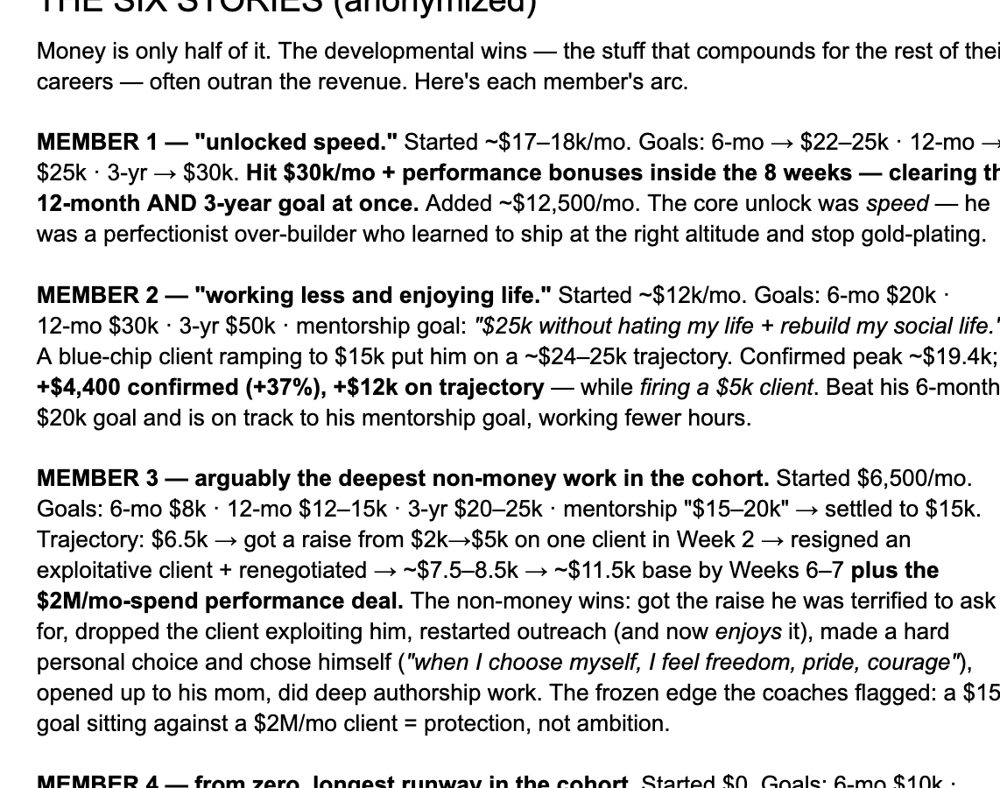

- **Expected:** clicking **anywhere on the field/bar** opens the date picker.
- **Proposed fix:** make the full input open the picker on click — e.g. call `input.showPicker()` on a wrapper click, or expand the clickable target to the whole field rather than only the icon.
- **Status:** open.

### #45 — Gambit "Brain-dump" placeholder is unprofessional ("random shit")
- **Area:** Ideation panel — **Gambit | Organic | Swipe** tabs → **Gambit** "Brain-dump".
- **Severity:** P2 (customer-facing copy / professionalism).
- **What:** The Gambit Brain-dump textarea placeholder reads **"A bunch of random shit you think — one pass splits it into discrete ideas."** Button: **"Split into ideas."** Lucas: "We still have this random shit-looking thing here." Too crude for a customer surface.
- **Where:** Ideation → tabs "Gambit | Organic | Swipe" (Gambit selected) → "Brain-dump" label + textarea + "Split into ideas" button.
- **Repro:** open the Gambit tab → read the placeholder.
**Screenshot:**

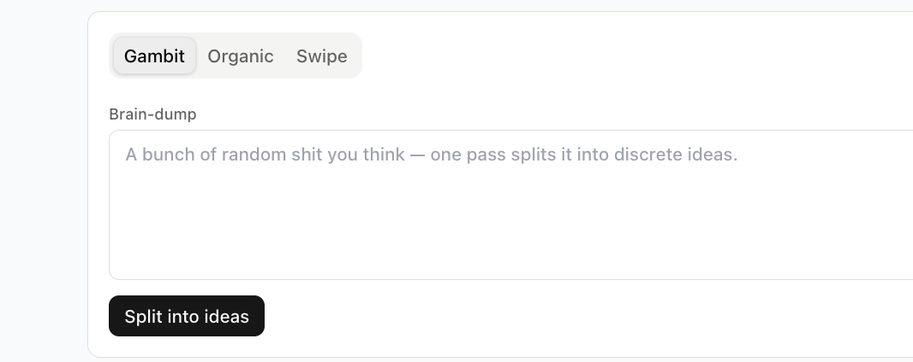

- **Expected:** professional placeholder, e.g. *"Dump every idea, angle, or note you have — one pass splits it into discrete ideas."*
- **Proposed fix:** rewrite the placeholder; **audit other placeholders** for the same crude tone (cf. the steering "nasty toenail fungus" example in #37, the "Grandfather pill batch" batch-name example).
- **Status:** open — Lucas notes "still" (flagged before).

### #46 — Primer editor: primers are too long; make each collapsible
- **Area:** Settings → **Primer** tab → the four primers.
- **Severity:** P1 — can't navigate/sort the primers; one fills the whole screen.
- **What:** The Primer tab renders all four primers (Body Unaware/Problem-aware · Body Solution/Product-aware · Hook · Headline) as **fully-expanded raw text blocks**. The first one ("Body copy — Unaware / Problem-aware") alone fills the screen with primer text (*"Please process this and tell me you understand… ### IMPORTANT… ### EXAMPLES… Ad 1: My Wife Stopped Undressing In Front Of Me…"*). Lucas: "These primers here are still way too long. They need to be collapsible so we can easily sort through them."
- **Where:** Settings → **Primer**. Header: *"Primers — The four primers this brand writes from… Edit and give each its own 'always use / don't use' steering. These shape every Genesis run for this brand."*
- **Repro:** Settings → Primer → scroll; each primer is a long expanded block, hard to sort through.
**Screenshot:**

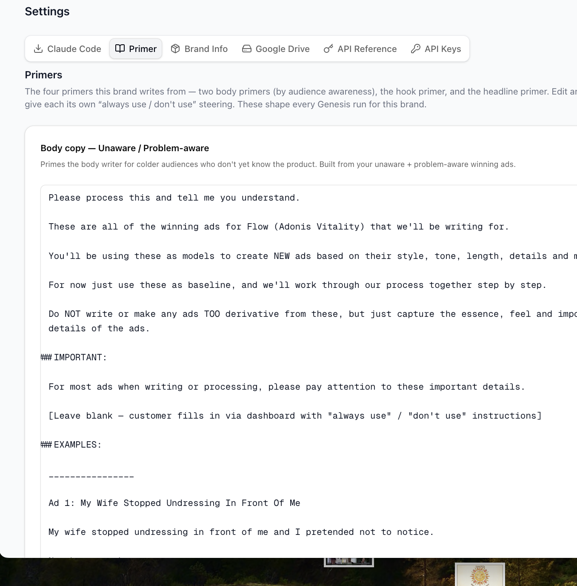

- **Expected:** each primer is **collapsible** — collapsed by default showing title + summary, expandable on click — so the four are scannable/sortable.
- **Proposed fix:**
  1. Render each primer in a **collapsible accordion** (collapsed by default; click title to expand).
  2. Collapsed header shows a **one-line summary + char count + last-edited**.
  3. When expanded, cap height with internal scroll so one primer can't dominate the page.
- **Status:** open — Lucas notes "still" (likely flagged in v1.1 Primer Studio §6); recurring.

---

## Action index (for Brad)

| Action | Finding | Severity | One-liner | Status |
|---|---|---|---|---|
| A.45 | #37 | P1 | Make Ad copy conditionally required (only when Reptile/Copy-Derived > 0); allow steering-only runs; move Steering above Ad copy | open · needs-brad-input |
| A.46 | #38 | P1 | Unify Native + Template into one "Run ads" batch; persist both engines' config across toggle (no clobber) | open |
| A.47 | #39 | P1 | Per-template input manifest + run-time validation; add handwritten-note input; wire founder/product assets to templates | open · needs-brad-input |
| A.48 | #40 | P1 | Fix Library Search — index concept/copy/steering/template/tags + semantic search; verify older runs are indexed | open · needs-brad-input |
| A.49 | #41 | P1 | Swipe-mining grid: store/render video poster frames; fix broken static thumbnails; visual cleanup | open |
| A.50 | #42 | P1 | Resolve/prompt FB Page ID for IG-only brands; gate Run-swipe-mining; clean error surface; hide Regression-Preflight test brands | open · needs-brad-input |
| A.51 | #43 | P2 | Show video poster frame in "Swipe this ad" preview; keep awareness-level flow as-is | open · confirm-intent |
| A.52 | #44 | P2 | Make the whole "Since" date field open the picker, not just the calendar icon | open |
| A.53 | #45 | P2 | Rewrite Gambit "Brain-dump" placeholder; audit other crude placeholders | open |
| A.54 | #46 | P1 | Make the four primers collapsible (collapsed default + summary header + capped height) | open |

---

## Open questions for Brad / Lucas

-
